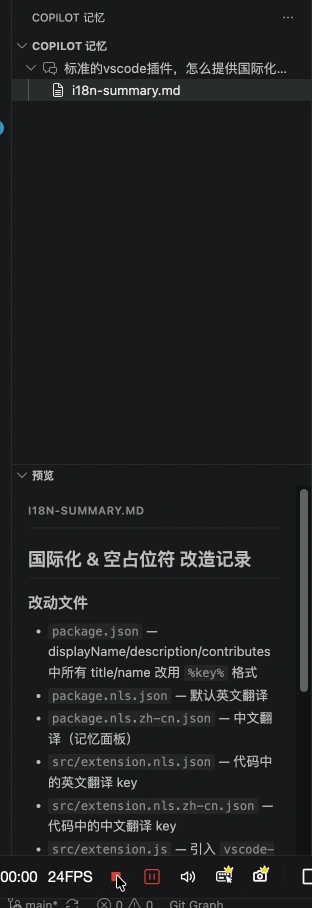

  

<h1 align="center">Copilot Memory Explorer</h1>

  
  
  
   
  <a href="README.md">English</a> ·
  <a href="README.zh-cn.md">简体中文</a> ·
  <a href="README.ja.md">日本語</a> ·
  <a href="README.ko.md">한국어</a> ·
  <a href="README.fr.md">Français</a> ·
  <a href="README.de.md">Deutsch</a>

Parcourez et gérez les fichiers mémoire de GitHub Copilot avec l'interface native de VS Code.

GitHub Copilot accumule des « mémoires » au fil des conversations, enregistrant le contexte de votre projet, vos préférences de codage, vos décisions architecturales et d'autres informations à long terme. Ces mémoires sont stockées localement sous forme de fichiers Markdown, mais il n'existe pas d'interface intégrée pour les parcourir ou les gérer.

**Copilot Memory Explorer** comble cette lacune : il fournit une vue native dans la barre latérale de VS Code, vous permettant de parcourir et gérer toutes les mémoires Copilot organisées par session de chat.

## Démo

  

## Fonctionnalités

- **Arborescence native** — Vue latérale avec menus contextuels natifs VS Code
- **Navigation par session** — Parcourez toutes les sessions de chat avec des entrées mémoire
- **Arborescence de fichiers** — Analyse récursive des répertoires de session, affichage des fichiers et sous-répertoires
- **Aperçu Markdown** — Cliquez sur un fichier pour voir le Markdown rendu dans le panneau d'aperçu
- **Aperçu d'images** — Visualisez les images dans le panneau d'aperçu
- **Menus contextuels** — Clic droit pour copier le chemin, afficher dans le Finder, supprimer ou créer une nouvelle mémoire
- **Tri** — Alternez le tri par nom ou par date depuis la barre de titre de la vue
- **Nouvelle mémoire** — Créez de nouveaux fichiers mémoire directement depuis la barre latérale

## Utilisation

1. Cliquez sur l'icône **Copilot Memories** dans la barre d'activité
2. Parcourez les sessions et développez-les pour voir les fichiers mémoire
3. Cliquez sur un fichier pour l'ouvrir dans l'éditeur et le panneau d'aperçu
4. Clic droit pour les options du menu contextuel

## Prérequis

- VS Code 1.96+
- GitHub Copilot (pour générer des mémoires)

## Notes de version

Consultez [CHANGELOG.md](CHANGELOG.md) pour l'historique des versions.

## Licence

[MIT](LICENSE)